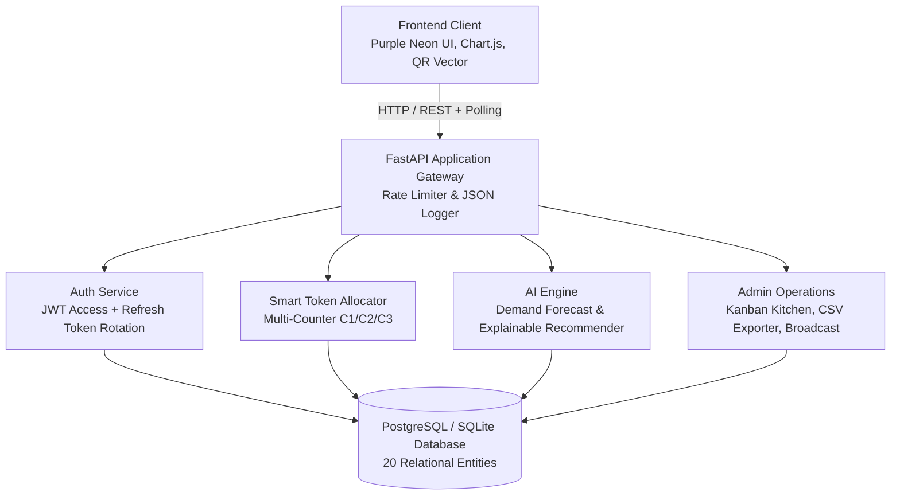

# System Architecture - Digital Canteen Token System

## 1. System Overview

The **Digital Canteen Token System (Canteen OS)** is a full-stack, AI-integrated campus dining and kitchen management platform designed to eliminate counter congestion, provide accurate turnaround predictions, streamline multi-counter order preparation, and deliver a modern **Purple Neon Cyberpunk** user experience.

---

## 2. Architectural Layers

### A. Frontend Layer (Vanilla ES6+ & Purple Neon Design System)
- **Design Tokens**: Dark cyberpunk aesthetic (`--bg-base: #0a0118`, `--bg-surface: #140728`, `--primary: #b026ff`, `--secondary: #ff2ee6`, `--accent: #00e5ff`).
- **Typography**: Google Fonts `Space Grotesk` (clean body text) and `Orbitron` (futuristic display headings and token numbers).
- **Core Components**:
  - **Signature Glowing Token Card**: Animated conic gradient border (`conic-gradient(#b026ff, #ff2ee6, #00e5ff)`), status pulse, and audio chimes on `Ready` transition.
  - **In-Browser QR Generator**: Standalone mathematical Reed-Solomon vector QR renderer in pure JavaScript (`js/qr.js`).
  - **Chart.js Visualizations**: Revenue trends, peak rush hours distribution, and 7-day predicted vs. actual demand chart.
  - **Live Kanban Kitchen Board**: Real-time counter-scoped order processing lanes (`Waiting`, `Preparing`, `Ready`).
  - **Loyalty Recognition**: Dynamic tier pills in the navigation bar (`Newbie`, `Foodie`, `Regular`, `VIP Legend`).

### B. Backend Layer (FastAPI & Python 3.11+)
- **Security & Rate Limiting**: In-memory thread-safe `LoginRateLimiter` allowing 5 failed attempts per 5 minutes before locking with HTTP 429 for 15 minutes.
- **Session Lifecycle**: 30-minute JWT access tokens coupled with 7-day rotating refresh tokens (`/api/auth/refresh`) and logout invalidation (`/api/auth/logout`).
- **Structured Request Logging**: `RequestLoggingMiddleware` outputting timestamped JSON logs to `logs/canteen_requests.log` with sensitive fields (`password`, `token`, `authorization`) masked.
- **Reporting Engine**: CSV sales report streaming (`/api/admin/export-sales`) with summary metrics and per-counter breakdowns.

### C. Multi-Counter Smart Allocation & AI Intelligence
- **Multi-Counter Stations**:
  - **Counter 1 (`C1`)**: South Indian & Hot Meals (Dosa, Thali, Biryani, Rice bowls).
  - **Counter 2 (`C2`)**: Fast Food, Snacks & Grill (Burgers, Sandwiches, Samosas, Rolls).
  - **Counter 3 (`C3`)**: Cafe, Beverages & Desserts (Chai, Cold Coffee, Juices, Brownies).
- **Token Allocator**: Generates station-prefixed tokens (`C1-101`, `C2-102`, `C3-103`), balancing station load and factoring in preparation complexity.
- **Demand Forecasting with Overrides**: Combines 7-day weighted moving averages, meal slot coefficients, and admin override injections with auditable reasons.
- **Explainable Recommendations**: Curates meal suggestions with honest, human-readable rationale badges (order history, time slot, protein content).

### D. Relational Database Layer (PostgreSQL / SQLite)
- 20 normalized tables with foreign key constraints, cascade deletes, and composite indices.
- Auto-seeding on startup with multi-counter records and 7-day historical order distributions.
