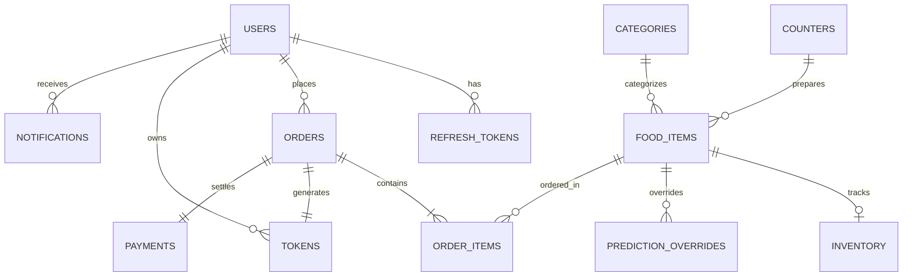

# Relational Database Schema & Entities - Digital Canteen Token System

## 1. Schema Overview

The database is built on **PostgreSQL** (and fully compatible with SQLite for testing/local setups). It contains 20 relational entities with strict referential integrity, cascading rules, and composite indices.

---

## 2. Table Catalog

### `counters`
Physical preparation and pickup stations.
- `id` (PK, SERIAL)
- `name` (VARCHAR 100, UNIQUE) - e.g. "Counter 1 (Main Kitchen)"
- `code` (VARCHAR 20, UNIQUE) - e.g. "C1", "C2", "C3"
- `station_type` (VARCHAR 100) - e.g. "South Indian & Hot Meals"
- `description` (TEXT)
- `is_active` (BOOLEAN, DEFAULT TRUE)
- `display_order` (INTEGER, DEFAULT 0)
- `created_at` (TIMESTAMP)

### `refresh_tokens`
Rotating refresh tokens for secure session continuity.
- `id` (PK, SERIAL)
- `user_id` (FK -> users.id, CASCADE)
- `token_hash` (VARCHAR 255, UNIQUE)
- `expires_at` (TIMESTAMP)
- `revoked` (BOOLEAN, DEFAULT FALSE)
- `created_at` (TIMESTAMP)

### `prediction_overrides`
Admin adjustments to AI demand forecasting with audit logging.
- `id` (PK, SERIAL)
- `food_item_id` (FK -> food_items.id, CASCADE)
- `prediction_date` (DATE)
- `meal_slot` (VARCHAR 30) - 'Breakfast', 'Lunch', 'Snacks', 'Dinner'
- `original_predicted_quantity` (INTEGER)
- `override_quantity` (INTEGER)
- `reason` (TEXT)
- `overridden_by` (FK -> users.id, RESTRICT)
- `created_at` (TIMESTAMP)

### `users`
Student, staff, and admin accounts.
- `id` (PK, SERIAL)
- `name` (VARCHAR 100)
- `email` (VARCHAR 150, UNIQUE)
- `password_hash` (VARCHAR 255)
- `phone` (VARCHAR 20)
- `department` (VARCHAR 100)
- `role_id` (FK -> roles.id)
- `is_active` (BOOLEAN, DEFAULT TRUE)
- `created_at`, `updated_at` (TIMESTAMP)

### `food_items`
Catalog of campus food dishes.
- `id` (PK, SERIAL)
- `category_id` (FK -> categories.id)
- `counter_id` (FK -> counters.id)
- `name` (VARCHAR 150)
- `description` (TEXT)
- `price` (NUMERIC 10,2)
- `prep_time_minutes` (INTEGER)
- `is_veg` (BOOLEAN)
- `is_available` (BOOLEAN)
- `image_url` (TEXT)
- `calories`, `protein`, `carbs`, `fats`

### `orders` & `order_items`
Customer order transactions and line items.
- `id` (PK, SERIAL)
- `user_id` (FK -> users.id)
- `order_number` (VARCHAR 50, UNIQUE)
- `total_amount`, `final_amount` (NUMERIC 10,2)
- `status` (VARCHAR 30) - 'Confirmed', 'Preparing', 'Ready', 'Completed', 'Cancelled'
- `notes` (TEXT)

### `tokens`
Digital kitchen tickets with station-prefixed sequence numbers.
- `id` (PK, SERIAL)
- `order_id` (FK -> orders.id, CASCADE, UNIQUE)
- `user_id` (FK -> users.id)
- `token_number` (VARCHAR 20, UNIQUE) - e.g. "C1-104", "C2-105"
- `counter_number` (INTEGER)
- `queue_position` (INTEGER)
- `priority_score` (NUMERIC 5,2)
- `status` (VARCHAR 30) - 'Waiting', 'Preparing', 'Ready', 'Completed', 'Cancelled'
- `estimated_wait_minutes` (INTEGER)
- `called_at`, `ready_at`, `completed_at` (TIMESTAMP)
